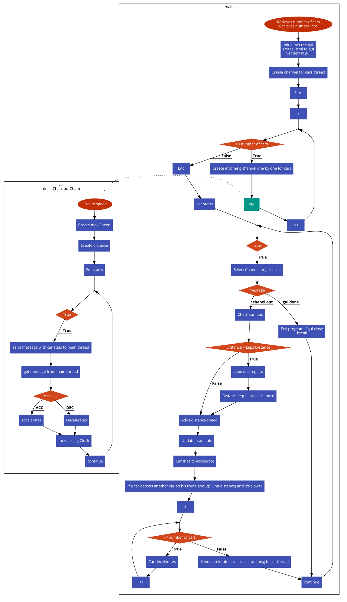

# Lorca Library

- A very small library to build modern HTML5 desktop apps in Go. It uses Chrome browser as a UI layer. 
- Lorca establishes a connection to the browser window and allows calling Go code from the UI and manipulating UI from Go in a seamless manner.

# Racers

- Each racer/car behaviour is implemented using separated thread/gorutine.
- Car function : `func car(id int, out chan Message, in chan string)` accepts the id, out channel and in
channel parameters. We create separate thread for each car using `go car(prams...)`.

# Channels
### In 
- `in` channel use for receiving command from main thread to car thread. Commands are acceleration
and deceleration. 
- When acceleration command are receive car tread do a acceleration using motion
quation: *v=u+at* where *a&times;t* where *u* is initial acceleration, *v* is a final acceleration and *a&times;t* are
acceleration and time. 
- Similarly when car thread is receive deceleration command it do a deceleration.
- `in` channel use `fan out`  method to communicate with main thread.

### Out
- `Out` channel use for sending a message from each car thread to main tread. Message is basically a car
current stats of speed, traveled distance, and spending time.
- `Out` channel use `fan in` method to communicate with main thread.

# Other Details
- Main thread keeps track of all stats of cars tread speed, travel distance, spending time. And send
commands to each car should accelerate or decelerate.
- GUI is use for displaying all cars and its current status speed, laps, spending time. And it also
displaying to three car stats.

# Flow Chart

