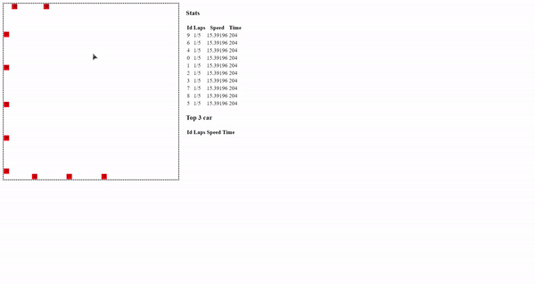

# Multithreaded Grand Prix Simulator
Implement a multithreaded grand prix simulator where every car will be an independent entity. You will be simulating an N laps race.

# Technical Requirements

- Go version 1.16.4 or later
- github.com/zserge/lorca v0.1.10
- golang.org/x/net v0.0.0-20210525063256-abc453219eb5

# Install / Execute / Run

- Run without installing:
- `$ go run main.go`
- Build and install:
- `$ go build main.go`
- `$ go install`

# Inputs

- Number of cars
- Number of laps